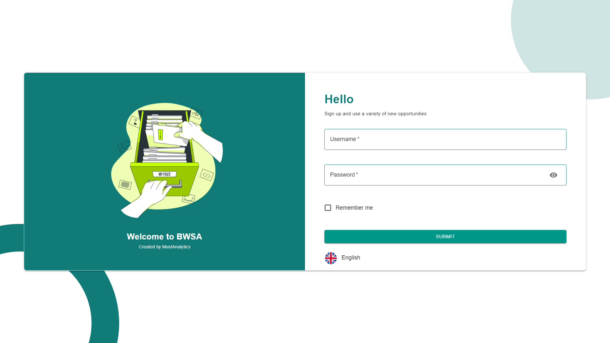
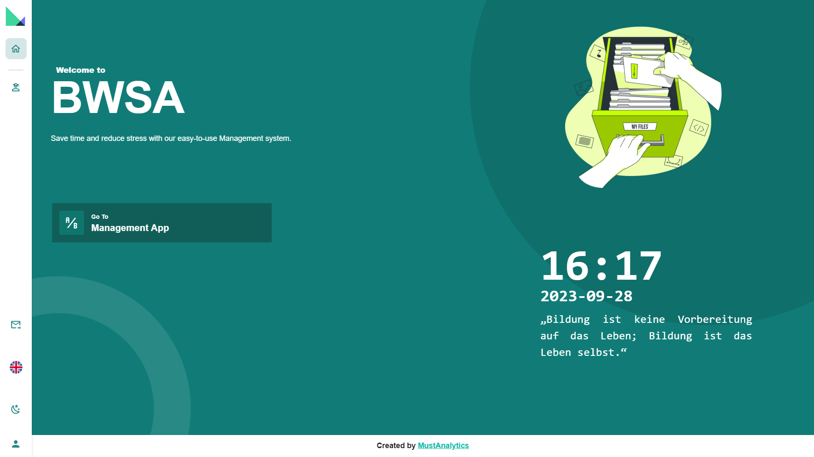
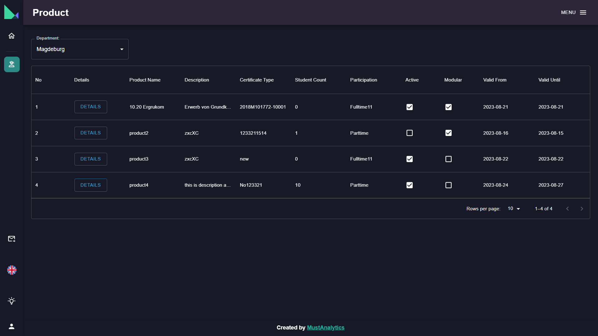
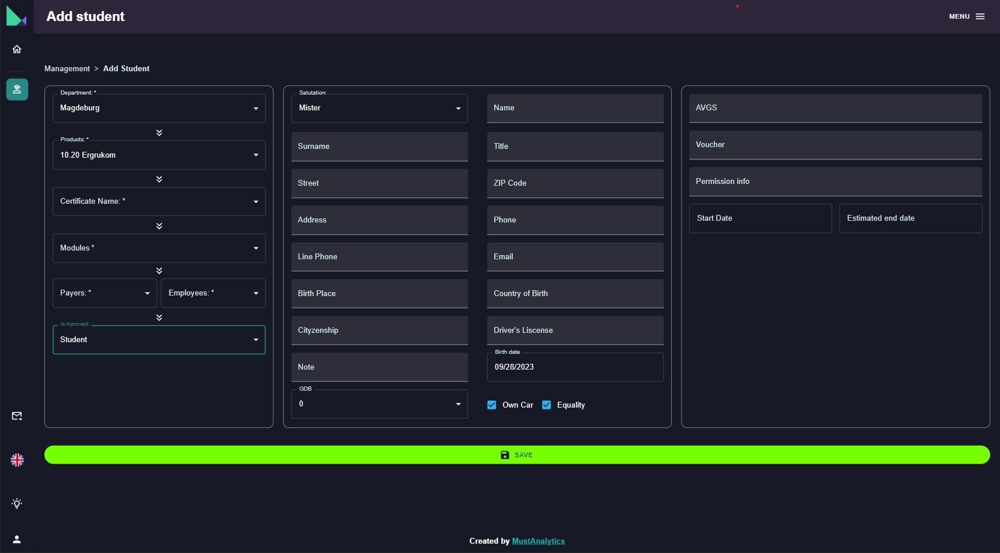

# BWSA

## Author: Tahir Tahirli

This project was aimed to help a german Education center to efficiently manage its internal data and help the company to make the document generation process. Users are able to select a student and generate documents based on pre-defined templates.

## Features

- ✔️ Authentication
- ✔️ Email sending
- ✔️ User Management
- ✔️ User Roles
- ✔️ JWT

## Tech

### - Frontend

- 🟢 [React] -  The library for web and native user interfaces.
- 🟢 [Tailwind] -  UI library.
- 🟢 [Docxtemplater] - Generating docx using Javascript.
- 🟢 [Scss] -  CSS extension language.
- 🟢 [Material-UI] -  CSS extension language.

#### - Backend

- 🟢 [Asp .Net Core 6.0] - ASP.NET Core is a cross-platform framework for building modern apps.
- 🟢 [Asp .Net Web Api] - Building RESTful applications on the .NET Framework.
- 🟢 [Entity framework core] - Entity Framework is an Object/Relational Mapping (O/RM) framework

## Contact Me

| # | |
| ------ | ------ |
|📱 Phone | +994 077 547 49 48 |
|📧 Email | tahirlitahirr@gmail.com|
|📧 Email | tahiret@code.edu.az|
|📄 Linked In|https://www.linkedin.com/in/tahirtahirli/|

## More Photos

[//]: # (These are reference links used in the body of this note and get stripped out when the markdown processor does its job. There is no need to format nicely because it shouldn't be seen. Thanks SO - http://stackoverflow.com/questions/4823468/store-comments-in-markdown-syntax)
   [Scss]: <https://sass-lang.com/>
   [Asp .Net Core 6.0]: <https://learn.microsoft.com/en-us/aspnet/core/release-notes/aspnetcore-6.0?view=aspnetcore-7.0>
   [Asp .Net Web Api]: <https://dotnet.microsoft.com/en-us/apps/aspnet/apis>
   [Entity framework core]: <https://learn.microsoft.com/en-us/ef/>
   [Material-UI]: <https://mui.com/>
   [React]: <https://react.dev/>
   [Tailwind]: <https://tailwindcss.com/>
   [Docxtemplater]: <https://docxtemplater.com/>
